# KMHv3 RTL 技术讨论：向量

> 从 PPTX 自动抽取生成，面向后续 AI 阅读、检索和复用。PPT 中由形状绘制的示意图会转为文本块；PPT 中嵌入的位图资源已复制到相邻 `images/` 目录并在对应 slide 下链接。

## 元数据

- 源文件：`/Users/yanyue/Library/Containers/com.tencent.xinWeChat/Data/Documents/xwechat_files/wxid_9r6iyr3jwn4d22_3991/temp/drag/20260129-KMHv3 RTL技术讨论-向量.pptx`
- 原始文件名：`20260129-KMHv3 RTL技术讨论-向量.pptx`
- 幻灯片页数：32
- 图片目录：`images/20260129-KMHv3-RTL技术讨论-向量/`
- 转换时间：2026-06-09 11:12:24
- 文档标题：PowerPoint 演示文稿
- 创建者：胡轩
- 最后修改者：轩 胡
- 创建时间：2021-05-15T13:17:54Z
- 修改时间：2026-01-29T05:12:00Z

## 目录

- [Slide 1: 香山向量起飞计划](#slide-01)
- [Slide 2: RISC-V向量扩展简介[1]](#slide-02)
- [Slide 3: 向量配置介绍](#slide-03)
- [Slide 4: 向量配置介绍](#slide-04)
- [Slide 5: 向量有效元素[1]](#slide-05)
- [Slide 6: 香山处理器向量设计简介](#slide-06)
- [Slide 7: 一个浮点加法的例子](#slide-07)
- [Slide 8: 一个浮点加法的例子](#slide-08)
- [Slide 9: 旧向量重要缺陷总览](#slide-09)
- [Slide 10: 独立配置指令带来的问题](#slide-10)
- [Slide 11: 译码UOP吞吐问题](#slide-11)
- [Slide 12: 译码拆分](#slide-12)
- [Slide 13: 调度问题-唤醒](#slide-13)
- [Slide 14: 调度问题-谓词](#slide-14)
- [Slide 15: strlen 例子](#slide-15)
- [Slide 16: 优化后的谓词调度](#slide-16)
- [Slide 17: 谓词生成指令性能对比](#slide-17)
- [Slide 18: permutation 指令介绍](#slide-18)
- [Slide 19: vrgather 指令](#slide-19)
- [Slide 20: 一维脉动阵列加速VRGATHER](#slide-20)
- [Slide 21: 时序和面积数据](#slide-21)
- [Slide 22: 预期的性能数据对比](#slide-22)
- [Slide 23: 向量访存现有缺陷](#slide-23)
- [Slide 24: 向量访存起飞核心思路](#slide-24)
- [Slide 25: 新向量访存架构](#slide-25)
- [Slide 26: 向量简单连续访存](#slide-26)
- [Slide 27: 非连续访存的地址UOP](#slide-27)
- [Slide 28: 非连续访存的index/stride UOP](#slide-28)
- [Slide 29: 利用已有的向量-标量通路](#slide-29)
- [Slide 30: 向量访存起飞核心思路](#slide-30)
- [Slide 31: 时间计划](#slide-31)
- [Slide 32: 敬请批评指正！](#slide-32)

## 幻灯片内容

### Slide 1: 香山向量起飞计划

**文本**

- 2026 年 1 月 29 日
- 胡轩

**图片资源**

- `slide01_image01_image6.png`，2652x2651：`images/20260129-KMHv3-RTL技术讨论-向量/slide01_image01_image6.png`

### Slide 2: RISC-V向量扩展简介[1]

**文本**

- 可编程寄存器
- v0~v31 32个向量寄存器，v0还用做谓词寄存器
- vstart 向量起始位置
- vl 向量长度
- vtype 向量配置，包括元素位宽和寄存器组个数等
- …
- 特点
- 位宽信息由向量配置指令设定
- 可变向量长度
- 向量谓词化
- 寄存器组可扩充8x向量长度

**表格**

| vl |
| --- |
| vtype |
| vlenb |
| vstart |
| vxsat |
| vxrm |
| vcsr |

**表格**

| v0 |
| --- |
| v1 |
| ... |
| v31 |

- 新增向量寄存器

- 新增向量 CSR

- [1] https://github.com/riscv/riscv-v-spec

**外部链接**

- https://github.com/riscv/riscv-v-spec

### Slide 3: 向量配置介绍

**文本**

- SEW(Selected Element Width)
- 指定向量元素位宽（8、16、32、64）
- 由向量配置指令设置

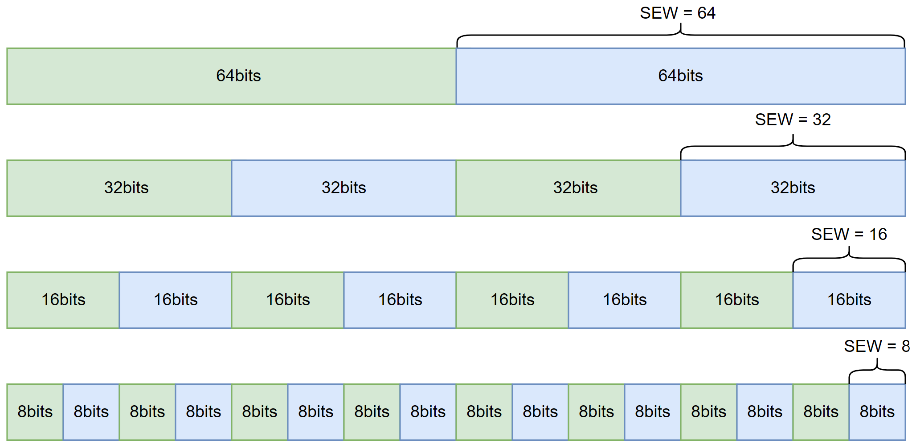

- 不同位宽的元素划分

**图片资源**

- `slide03_image01_image7.png`，2047x1006：`images/20260129-KMHv3-RTL技术讨论-向量/slide03_image01_image7.png`

### Slide 4: 向量配置介绍

**文本**

- LMUL(vector Length MULtiplier)
- 指定向量寄存器数量（1/8, 1/4, 1/2, 1, 2, 4, 8）
- 由向量配置指令设置
- 寄存器编号须按 LMUL 对齐

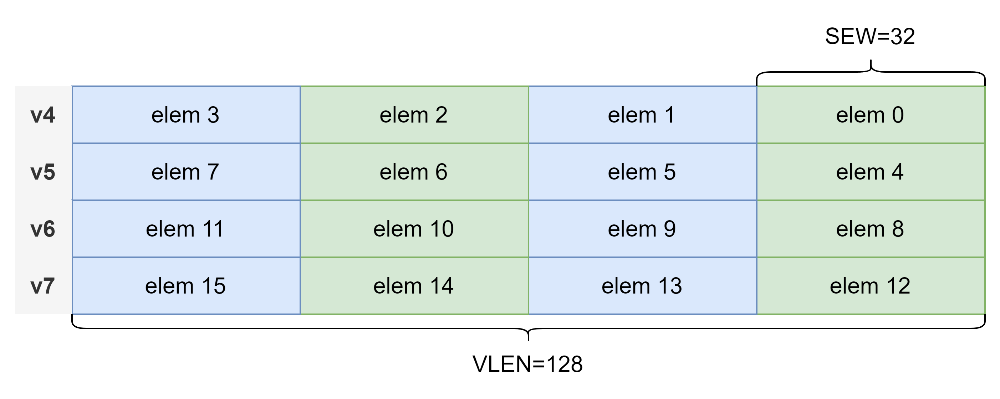

- LMUL=4 的 v4 向量寄存器

**图片资源**

- `slide04_image01_image8.png`，2804x1120：`images/20260129-KMHv3-RTL技术讨论-向量/slide04_image01_image8.png`

### Slide 5: 向量有效元素[1]

**文本**

- 由 vstart、vl、v0 寄存器共同指定
- 通常仅有 active 元素参与运算

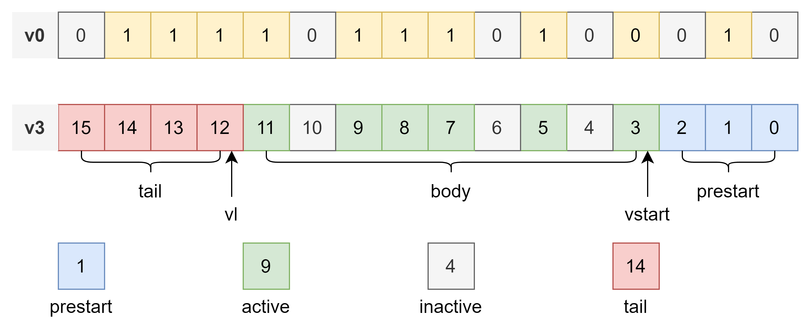

- [1] https://github.com/riscv/riscv-v-spec 5.4. Prestart, Active, Inactive, Body, and Tail Element Definitions

**图片资源**

- `slide05_image01_image9.png`，2804x1164：`images/20260129-KMHv3-RTL技术讨论-向量/slide05_image01_image9.png`

**外部链接**

- https://github.com/riscv/riscv-v-spec

### Slide 6: 香山处理器向量设计简介

**文本**

- 基本规格
- RISC-V 指令集：V, Zvfh, Zvbb
- VLEN=128，2 条流水线
- 支持数据类型：INT8~64，FP16~64，暂不支持 BF16 等
- 支持全部 LMUL 配置（最大向量长度1024bit）
- 紧耦合重命名架构
- 以向量寄存器粒度拆分 uop
- ROB 压缩方式支持 LMUL>1
- 复用标量访存，扩展数据位宽至128bit
- 向量长度寄存器 vl 重命名

### Slide 7: 一个浮点加法的例子

**文本**

- RVV是VLA（Vector Length Agnostic）式的向量扩展指令集，与ARM SVE类似
- 运算指令全3操作数导致编码空间不足，放不下元素位宽等信息
- 使用独立的配置指令完成 设置VL、SEW和LMUL等功能
- “配置指令协商机制”实现一套代码适配不同VLEN硬件

- 配置指令
- a3：软件指定的VL
- a5：硬件反馈的VL

- FP32 向量加法

- RVV汇编（由自动向量化生成）*

* https://godbolt.org/z/rdfPYPa6M

**图片资源**

- `slide07_image01_image11.png`，530x333：`images/20260129-KMHv3-RTL技术讨论-向量/slide07_image01_image11.png`
- `slide07_image02_image10.png`，534x365：`images/20260129-KMHv3-RTL技术讨论-向量/slide07_image02_image10.png`

### Slide 8: 一个浮点加法的例子

**文本**

- RVV是VLA（Vector Length Agnostic）式的向量扩展指令集，与ARM SVE类似
- 运算指令全3操作数导致编码空间不足，放不下元素位宽等信息
- 使用独立的配置指令完成 设置VL、SEW和LMUL等功能

- 配置指令要求使用8倍向量寄存器

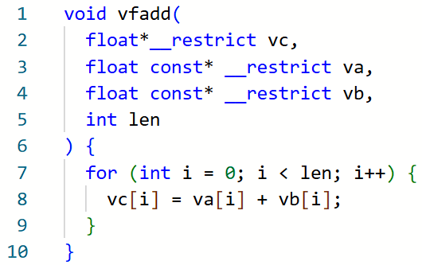

- v8指代v8~v15
- v16指代v16~v23

- FP32 向量加法

- RVV汇编（由自动向量化生成）*

* https://godbolt.org/z/rdfPYPa6M

**图片资源**

- `slide08_image01_image11.png`，530x333：`images/20260129-KMHv3-RTL技术讨论-向量/slide08_image01_image11.png`
- `slide08_image02_image10.png`，534x365：`images/20260129-KMHv3-RTL技术讨论-向量/slide08_image02_image10.png`

### Slide 9: 旧向量重要缺陷总览

**文本**

- 译码
- 输出的UOP吞吐不足
- 调度
- 未支持提前唤醒，指令等效执行延迟+3cycle，串行延迟长
- LMUL > 1 的谓词运算无法并行
- 运算指令
- Permutation 类指令延迟极高
- 访存指令
- 连续访存延迟10+cycle（ARM 6cycle，AMD 7cycle）
- Fof 指令未达到非 fof 指令的性能，影响 C 库函数性能
- 无法利用内存连续特性加速 Segment 指令

### Slide 10: 独立配置指令带来的问题

**文本**

- 控制依赖，配置指令执行 -> 运算指令拆分

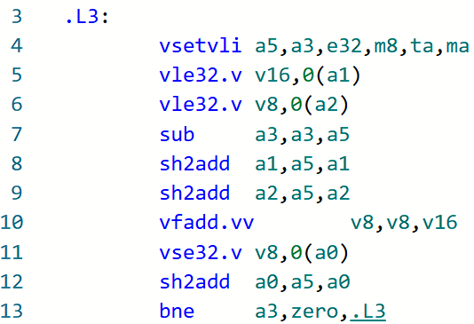

- 影响指令拆分

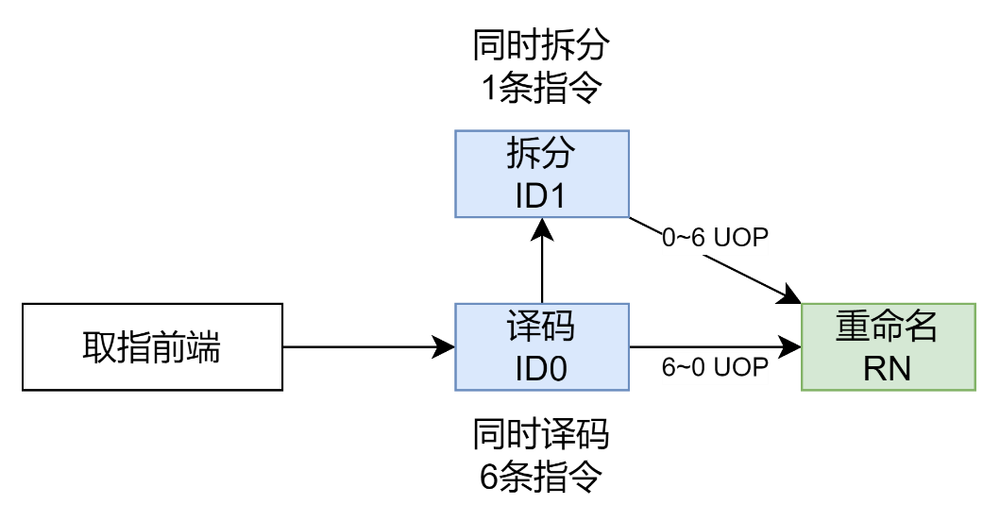

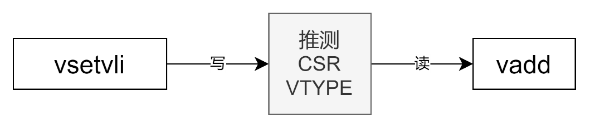

- 译码->拆分依赖

- 优化前的译码架构

**图片资源**

- `slide10_image01_image10.png`，534x365：`images/20260129-KMHv3-RTL技术讨论-向量/slide10_image01_image10.png`
- `slide10_image02_image13.png`，1059x552：`images/20260129-KMHv3-RTL技术讨论-向量/slide10_image02_image13.png`
- `slide10_image03_image12.png`，1059x234：`images/20260129-KMHv3-RTL技术讨论-向量/slide10_image03_image12.png`

### Slide 11: 译码UOP吞吐问题

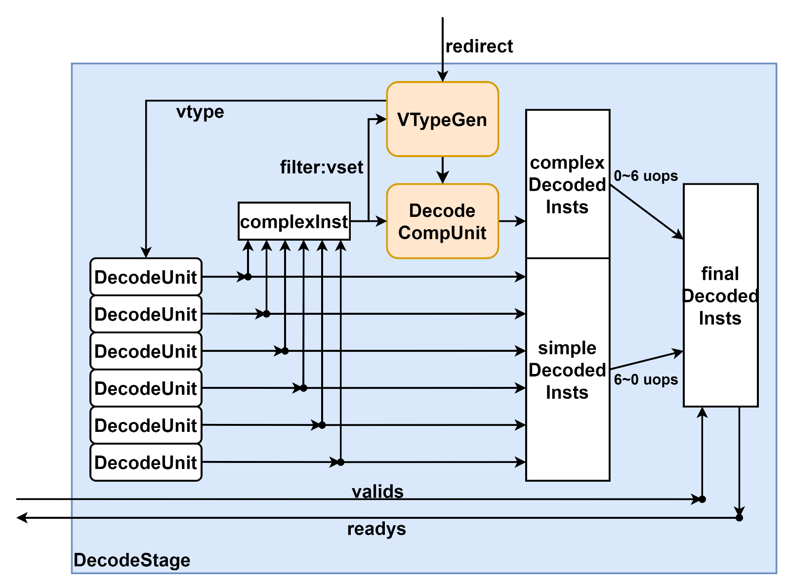

**文本**

- 配置指令在 VTypeGen 推测执行
- 1拍后指导译码拆分
- 产生向量指令前的bubble
- 单通道拆分
- 连续向量指令输出 UOP 受限于LMUL
- 每周期输出LMUL条UOP

**图片资源**

- `slide11_image01_image14.png`，1595x1182：`images/20260129-KMHv3-RTL技术讨论-向量/slide11_image01_image14.png`

### Slide 12: 译码拆分

**文本**

- 多通道拆分方案(CN120723313A,开芯院)
- 关键思路
- 限制拆分UOP数量为1、2、4和8等
- 不足则补充NOP（空操作）
- 特点
- 8发射配置下，混合指令流译码拆分1拍完成
- 除seg3/5/6/7 ls指令，保持8条UOP吞吐
- 初步时序评估满足需求
- DC评估最长路径<200ps，还有很大余量
- 向量浮点指令还未支持

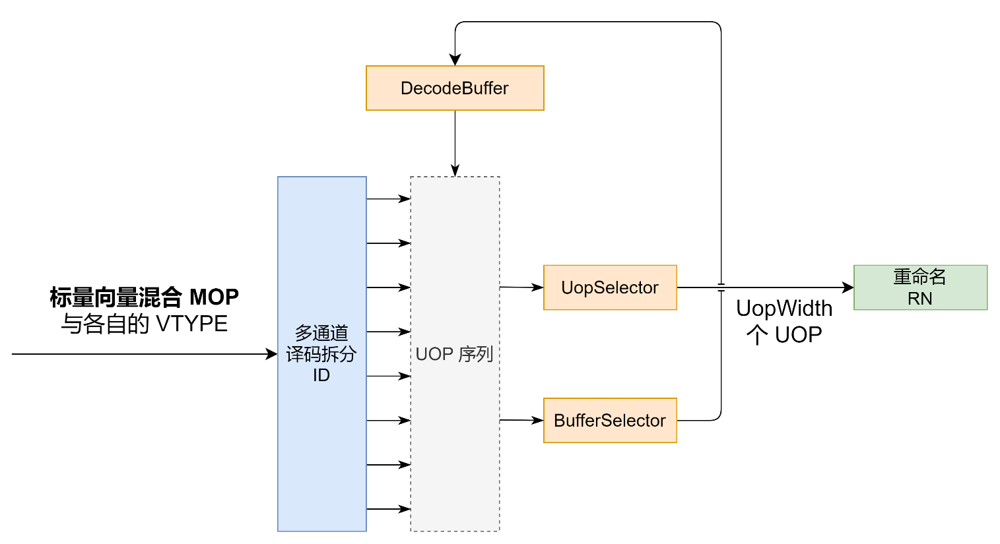

**图片资源**

- `slide12_image01_image15.png`，1515x825：`images/20260129-KMHv3-RTL技术讨论-向量/slide12_image01_image15.png`

### Slide 13: 调度问题-唤醒

**文本**

- 向量运算未支持提前唤醒
- 根本原因：向量算子时序差
- 算子时序问题正在逐个解决
- 向量 Load 未做提前唤醒
- 需支持提前写回 3 cycle 唤醒（在访存部分详细介绍）

### Slide 14: 调度问题-谓词

**文本**

- 谓词UOP之间存在RAW相关导致谓词无法并行

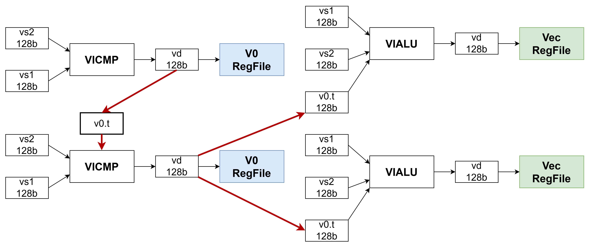

**图片资源**

- `slide14_image01_image16.png`，4398x1852：`images/20260129-KMHv3-RTL技术讨论-向量/slide14_image01_image16.png`

### Slide 15: strlen 例子

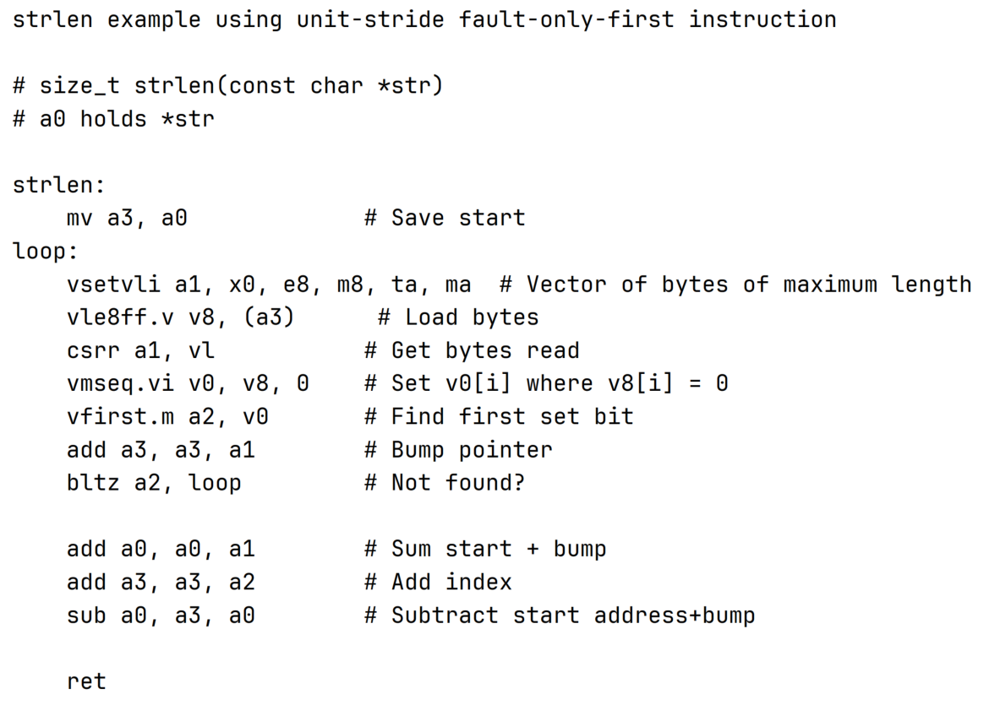

**文本**

- LMUL=m8
- 最大化访存+运算UOP的比例

- 谓词生成指令
- 在关键路径

- RVV规范中的向量 strlen 例程

**图片资源**

- `slide15_image01_image17.png`，1183x835：`images/20260129-KMHv3-RTL技术讨论-向量/slide15_image01_image17.png`

### Slide 16: 优化后的谓词调度

**文本**

- 消除向量谓词生成UOP之间的依赖关系

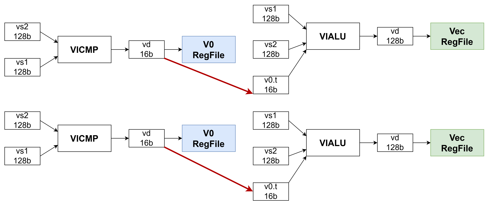

- 涉及RAT、RegFile、唤醒三处大改动

**图片资源**

- `slide16_image01_image18.png`，4398x1852：`images/20260129-KMHv3-RTL技术讨论-向量/slide16_image01_image18.png`

### Slide 17: 谓词生成指令性能对比

**表格**

| 实现 | m1 | m2 | m4 | m8 |
| --- | --- | --- | --- | --- |
| C920 | 2 | 1/2 | 1/4 | 1/8 |
| XS 旧设计 | 1.25 | 1/3 | 1/12 | 1/48 |
| XS 新设计（2PIPE） | 2 | 1 | 1/2 | 1/4 |
| XS 新设计（4PIPE） | 4 | 2 | 1 | 1/2 |

**文本**

- 指令吞吐对比（越大越好）

### Slide 18: permutation 指令介绍

**文本**

- vrgather, vslideup, vslidedown, vcompress 等运算，以及 segment 访存
- 实现 LMUL=1 的任意一种都不困难，2cycle 轻易实现 DLEN=128b
- ISVLSI’25 Efficient Implementation of RISC-V Vector Permutation Instructions
- 不支持 LMUL=8 无法符合规范
- 硬件替软件做循环（迭代和UOP拆分本质都是硬件替软件做循环）
- 别的方案？

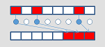

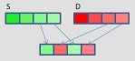

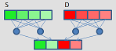

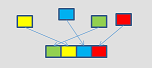

- unpack

- shuffle

- gather

- compress

- 各种permutation指令举例

- 图片来源 https://www.officedaytime.com/simd512e/

**图片资源**

- `slide18_image01_image22.png`，151x68：`images/20260129-KMHv3-RTL技术讨论-向量/slide18_image01_image22.png`
- `slide18_image02_image19.png`，149x67：`images/20260129-KMHv3-RTL技术讨论-向量/slide18_image02_image19.png`
- `slide18_image03_image20.png`，148x65：`images/20260129-KMHv3-RTL技术讨论-向量/slide18_image03_image20.png`
- `slide18_image04_image21.png`，152x68：`images/20260129-KMHv3-RTL技术讨论-向量/slide18_image04_image21.png`

### Slide 19: vrgather 指令

**文本**

- 指令实现索引取数的向量化
- 规范中定义如下
- 一个VLEN=128, LMUL=2, SEW=32的例子
- 拆分方案需要4个UOP

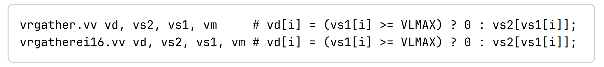

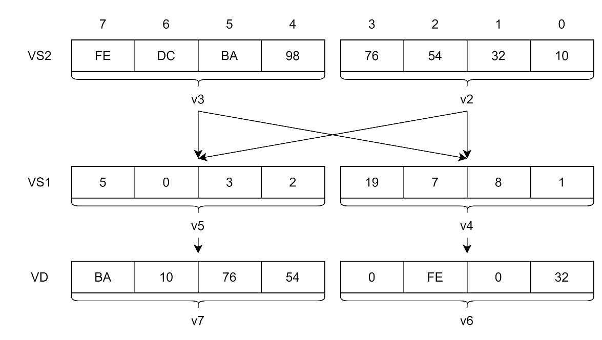

**图片资源**

- `slide19_image01_image23.png`，2397x267：`images/20260129-KMHv3-RTL技术讨论-向量/slide19_image01_image23.png`
- `slide19_image02_image24.png`，1175x664：`images/20260129-KMHv3-RTL技术讨论-向量/slide19_image02_image24.png`

### Slide 20: 一维脉动阵列加速VRGATHER

**文本**

- 多个GATHER单元组成一维阵列（CN120670030A, 开芯院）
- 延迟 LMUL，吞吐 1/LMUL
- 支持多条 vrgather 指令粒度 inflight，支持乱序

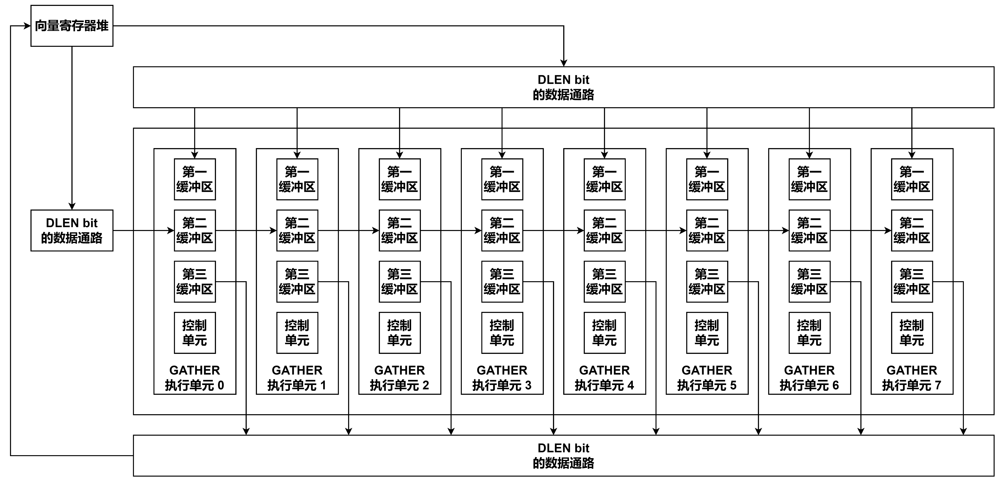

**图片资源**

- `slide20_image01_image25.png`，4398x2122：`images/20260129-KMHv3-RTL技术讨论-向量/slide20_image01_image25.png`

### Slide 21: 时序和面积数据

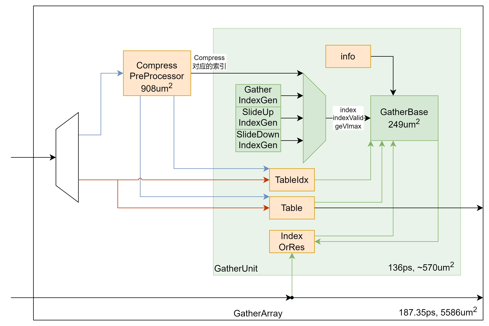

**文本**

- 面积数据在最严格时序下得出，333ps宽松下约3500~4000um2

**图片资源**

- `slide21_image01_image26.png`，3480x2324：`images/20260129-KMHv3-RTL技术讨论-向量/slide21_image01_image26.png`

### Slide 22: 预期的性能数据对比

**表格**

| 指令 | VRGATHER |  |  |  | compress |  |  |  | slideup/down |  |  |  |
| --- | --- | --- | --- | --- | --- | --- | --- | --- | --- | --- | --- | --- |
| LMUL | m1 | m2 | m4 | m8 | m1 | m2 | m4 | m8 | m1 | m2 | m4 | m8 |
| Tenstorrent Ascalon X | 1 | 2 | 16 | 62 | 1 | 6 | 13 | 34 | 1 | 4 | 14 | 43 |
| XuanTie C920 | 1 | 5 | 16 | 64 | 1 | 5 | 11 | 40 | 3 | 4 | 7 | 23 |
| Spacemit x100 | 2 | 8 | 32 | 128 | 3 | 10 | 36 | 136 | 2 | 4 | 8 | 16 |
| XS 旧设计 | 2 | 8 | 36 | 250 | 2 | 8 | 48 | 152 | 2 | 7 | 28 | 112 |
| XS 新设计 | 2 | 3 | 5 | 9 | 3 | 4 | 6 | 10 | 2 | 3 | 5 | 9 |

**文本**

- 预期的延迟数据对比（越小越好）

### Slide 23: 向量访存现有缺陷

**文本**

- 独立的VLSU IQ，使用额外i2v UOP，将向量访存的基地址搬移到向量域
- 向量访存与非对齐耦合，vl/s merge buffer中处理非对齐导致额外的设计&验证负担
- fault only first指令无法达到非fof相同的性能
- 特殊的strided访存未作合并，比如逆序连续
- 内存连续的segment逐个元素拆分众多mem op
- 非连续segment无法利用strcut内内存地址连续的特性
- vle 等简单连续访存延迟较大（香山 ~10 cycle，ARM 6 cycle，AMD 7 cycle）
- vl/s merge buffer 延长了流水线
- 未实现 vload 推测唤醒，等效延迟再 +3 cycle
- 内存连续的 Segment 指令延迟长吞吐拆分粒度太细

### Slide 24: 向量访存起飞核心思路

**文本**

- 更充分的复用标量访存流水线
- 简单连续访存从发射队列开始复用
- 其他向量访存经过 VAGU 拆访存 OP 后复用
- 向量不处理非对齐，跳过向量&非对齐几乎零收益的 bug 象限
- 加速最最最常用的访存模式 -> 提升简单连续访存性能（vle、vlm、vlnr等）
- XS 旧设计 ~10 cycle，ARM 6 cycle，AMD 7 cycle
- XS 新设计对齐 7 cycle，非对齐 8 cycle 吞吐减半
- 利用非简单连续访存的内存连续特性 -> 提升内存连续方法性能（vlseg2，vlse stride=-SEW等）
- 后端标量 LS 流水线引入 VAGU 做向量地址生成
- 类似 vl/s merge buffer，但不处理 vle vse
- 接在标量 LS 发射后执行前，最大程度降低延迟

- 向量
- (昆明湖v2)

- 向量非对齐
- (昆明湖v2)

- Bug inside

- 标量
- (昆明湖v1及以前)

- 标量非对齐
- (昆明湖v2)

### Slide 25: 新向量访存架构

**文本**

- 向量

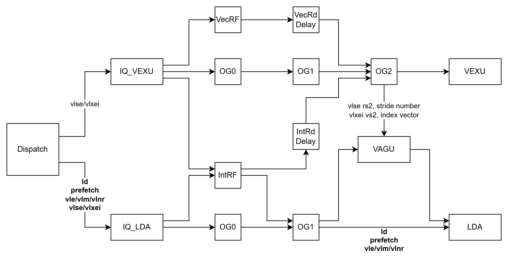

- 整数&访存

**图片资源**

- `slide25_image01_image27.png`，3124x1604：`images/20260129-KMHv3-RTL技术讨论-向量/slide25_image01_image27.png`

### Slide 26: 向量简单连续访存

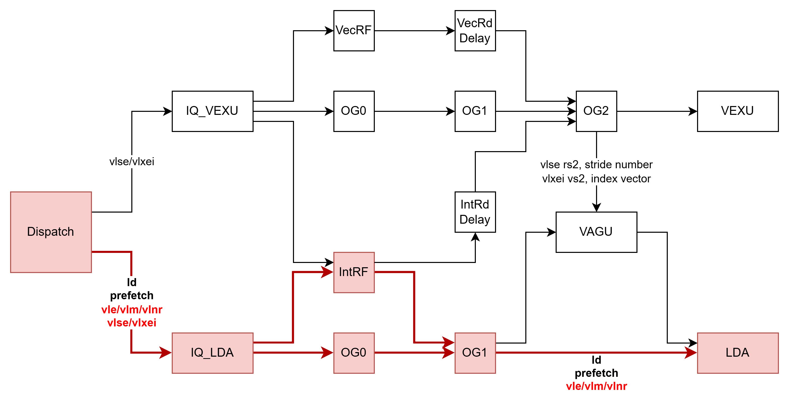

**图片资源**

- `slide26_image01_image28.png`，3124x1604：`images/20260129-KMHv3-RTL技术讨论-向量/slide26_image01_image28.png`

### Slide 27: 非连续访存的地址UOP

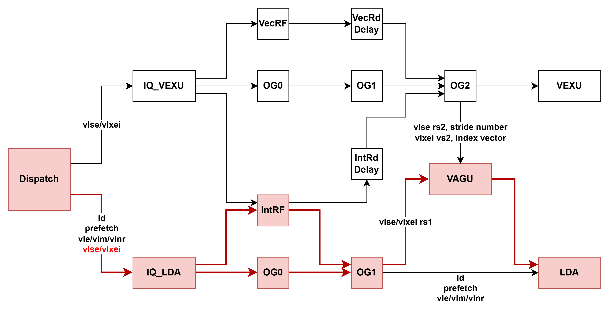

**图片资源**

- `slide27_image01_image29.png`，3124x1604：`images/20260129-KMHv3-RTL技术讨论-向量/slide27_image01_image29.png`

### Slide 28: 非连续访存的index/stride UOP

**文本**

- Stride 也可以在整数域复用 STD
- 或 给 LDA/STA 加一个标量操作数仲裁

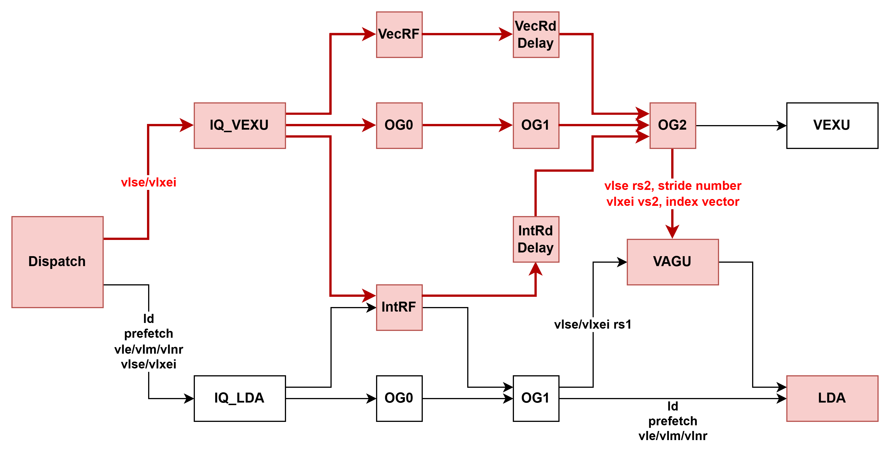

**图片资源**

- `slide28_image01_image30.png`，3124x1604：`images/20260129-KMHv3-RTL技术讨论-向量/slide28_image01_image30.png`

### Slide 29: 利用已有的向量-标量通路

**文本**

- vadd.vx 指令 vd[i] = vs2[i] + rs1
- 当然，IntRdDelay 的通路也是新设计
- 为了让vadd.vv 和 vadd.vx 的延迟一致

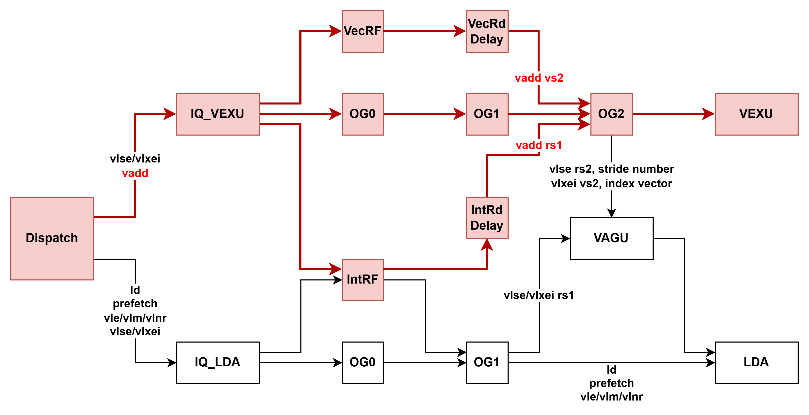

**图片资源**

- `slide29_image01_image31.png`，3124x1604：`images/20260129-KMHv3-RTL技术讨论-向量/slide29_image01_image31.png`

### Slide 30: 向量访存起飞核心思路

**文本**

- 更充分的复用标量访存流水线
- 简单连续访存从发射队列开始复用
- 其他向量访存经过 VAGU 拆访存 OP 后复用
- 向量不处理非对齐，跳过向量&非对齐几乎零收益的 bug 象限
- 加速最最最常用的访存模式 -> 提升简单连续访存性能（vle、vlm、vlnr等）
- XS 旧设计 ~10 cycle，ARM 6 cycle，AMD 7 cycle
- XS 新设计对齐 7 cycle，非对齐 8 cycle 吞吐减半
- 利用非简单连续访存的内存连续特性 -> 提升内存连续方法性能（vlseg2，vlse stride=-SEW等）
- 后端标量 LS 流水线引入 VAGU 做向量地址生成
- 类似 vl/s merge buffer，但不处理 vle vse
- 接在标量 LS 发射后执行前，最大程度降低延迟

- 向量
- (昆明湖v2)

- 向量非对齐
- (昆明湖v2)

- Bug inside

- 标量
- (昆明湖v1及以前)

- 标量非对齐
- (昆明湖v2)

### Slide 31: 时间计划

**文本**

- 全部向量垂直
- 运算通过测试

- 访存模块重写完成
- 开始对接向量

- 新谓词实现完成
- 启动性能评估

- 新向量访存实现完成

- 向量谓词破坏性修改合入主线，向量测试下线

- 指令拆分方案

- 译码

- 向量译码通道实现

- 新译码框架

- 向量MOVE
- 消除优化

- 向量谓词优化

- v0
- 参数重构

- 参数框架支持跨域等复杂唤醒

- vl
- 参数重构

- 调度

- 向量支持提前唤醒

- 1月

- 2月

- 3月

- 4月

- 5月

- 6月

- 7月

- 8月

- 9月

- 现在

- Segment优化

- LoadUnit 重写

- Fof 优化

- VAGU实现并支持非连续访存

- 16B对齐冒烟

- 访存

- SQ 重写

- 向量支持非对齐访存

- VRED/PERM 等

- 新算子集成&测试

- 算子

- 已有算子时序优化

- 向量新设计粗略文档

- GEM5对齐

- 其它

### Slide 32: 敬请批评指正！
