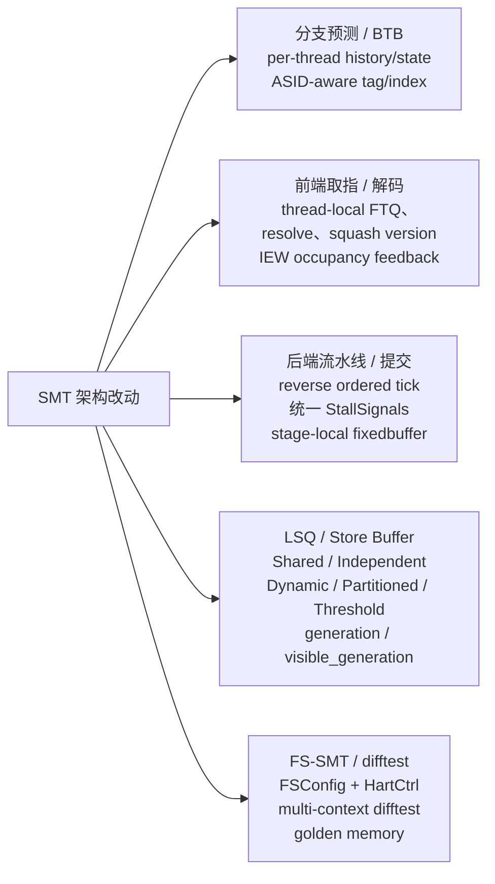
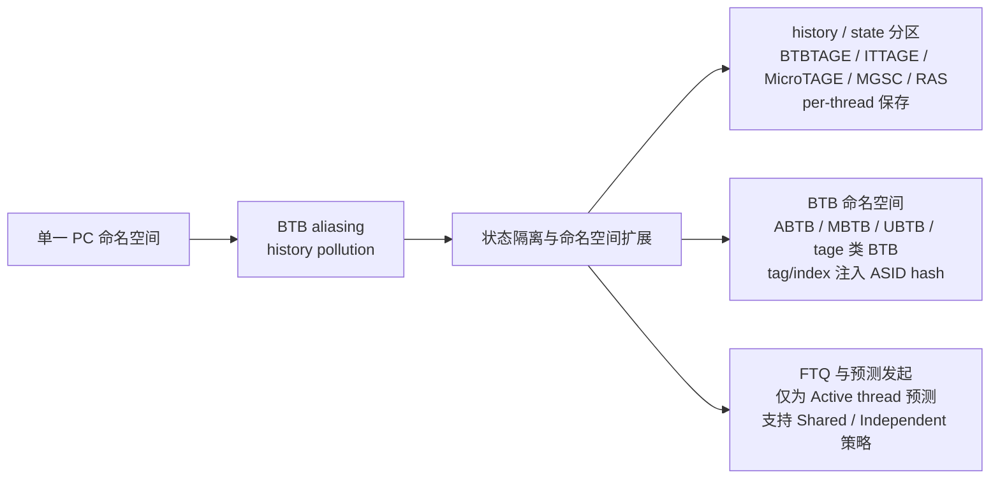
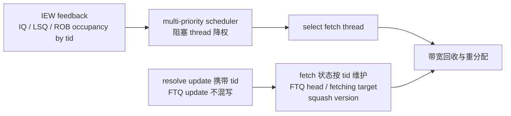
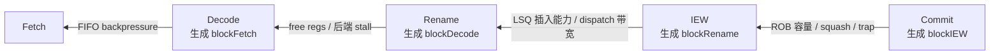
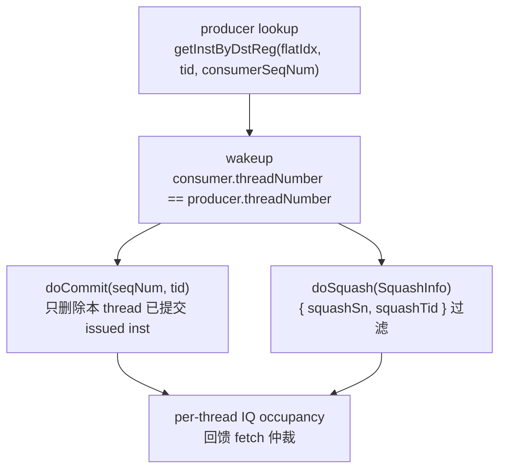
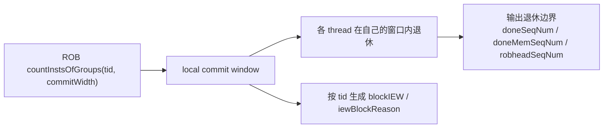
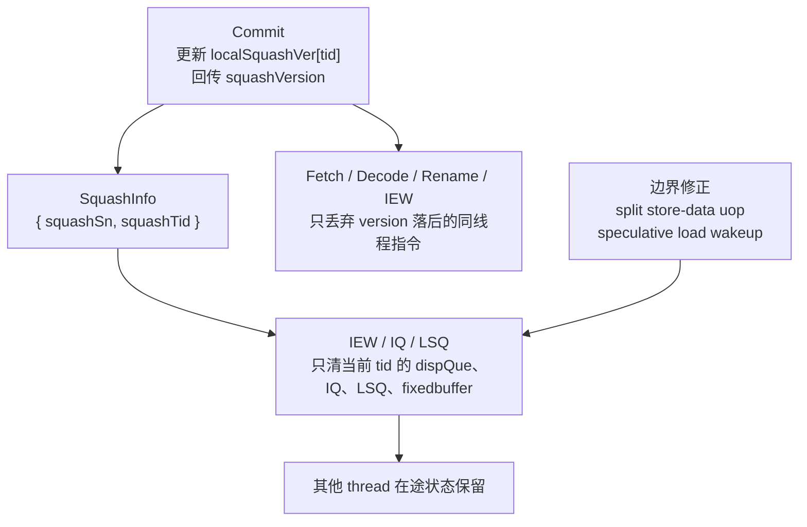
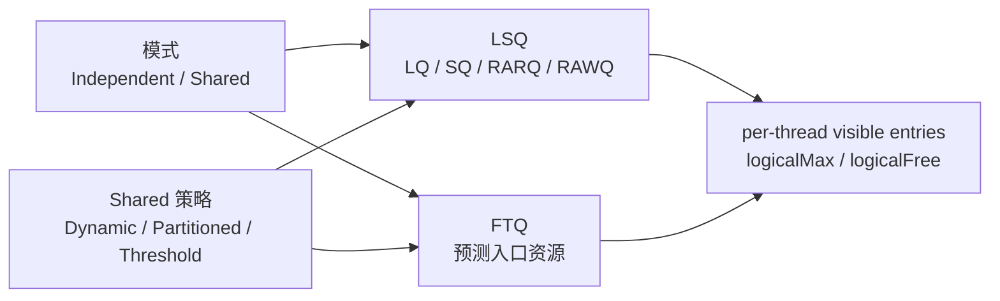
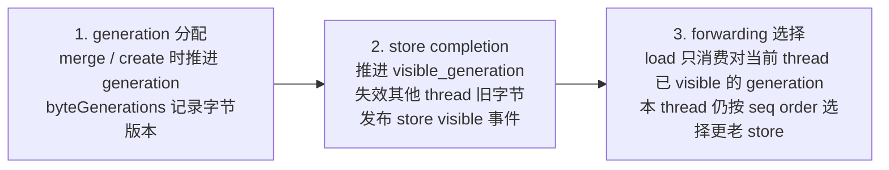
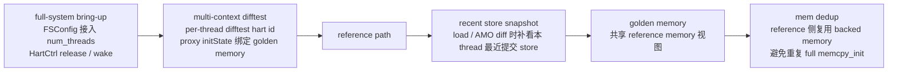

## 架构改动概览
本阶段 SMT 改动可以按五条主线理解：分支预测、前端、后端、访存、系统与验证。共同目标是把原来偏单线程默认值的状态，拆成 `thread`、`context` 和 `visibility` 三类边界。

| 主线 | 核心改动 | 隔离边界 |
| --- | --- | --- |
| 分支预测 / BTB | `BTB`、`BTBTAGE`、`ITTAGE`、`MicroTAGE`、`MGSC`、`RAS` 的历史或状态按线程维护；BTB tag / index 注入 ASID hash。 | `thread`、`ASID` |
| 前端取指 / 解码 | `Fetch`、`FTQ`、resolve update、squash version 改为 thread-local；IEW 把 `IQ / LSQ / ROB` 占用回馈给 fetch 仲裁。 | `thread` |
| 后端流水线 / 提交 | 通过 reverse ordered tick、统一 `StallSignals` 和 stage-local `fixedbuffer` 重构后向回压路径。 | `thread`、stage-local buffer |
| LSQ / Store Buffer | LSQ / FTQ 提供 Shared / Independent 模式和 Dynamic / Partitioned / Threshold 策略；shared sbuffer 定义 `generation / visible_generation`。 | `thread`、`visibility` |
| FS-SMT / difftest | `FSConfig` 与 `HartCtrl` 打通 full-system bring-up；multi-context difftest、golden memory、recent store snapshot 支撑 reference 对账。 | `context`、reference memory |

结论：SMT 相关状态的隔离维度已经扩展到 `thread`、`context` 与 `visibility` 三类边界。

## 分支预测器 SMT 设计
shared-address-space FS-SMT 下，同一 PC 可能来自不同线程和不同地址空间。若仍使用单一 PC 命名空间，会同时污染 BTB entry 与 predictor history。因此预测器侧的改动分成两层：BTB lookup / update 扩展为 `PC + ASID`，history / state 按 thread 分区保存。

关键点：

| 设计点 | 说明 |
| --- | --- |
| 冲突来源 | shared-address-space FS-SMT 中，同一 PC 不足以区分 thread 和地址空间。 |
| history / state 分区 | `BTBTAGE`、`ITTAGE`、`MicroTAGE`、`MGSC`、`RAS` 的历史和 meta 按 `tid` 保存，predict / update 不再共享一份历史。 |
| BTB 命名空间 | `ABTB`、`MBTB`、`UBTB` 和 tage 类 BTB 在 tag / index 中注入 ASID hash，使匹配从 PC 扩展为 `PC + ASID`。 |
| FTQ 策略 | Decoupled BPU 只对 Active thread 发起预测；FTQ 支持 Shared / Independent 以及 Dynamic / Partitioned / Threshold 语义。 |

代码线索：

+ `src/cpu/pred/btb/decoupled_bpred.cc:36` 从 `satp` 提取 ASID 并 fold 成 hash。
+ `src/cpu/pred/btb/common.hh:44` 与 `src/cpu/pred/btb/common.hh:56` 提供 tag 注入和 index xor。
+ `src/cpu/pred/btb/btb_tage.cc:107`、`src/cpu/pred/btb/btb_mgsc.cc:63`、`src/cpu/pred/btb/ras.cc:27` 可看到 predictor component 的 per-thread 状态。

结论：分支预测路径具备 per-thread history 与 ASID-aware BTB 命名空间。

## 前端取指 SMT 设计
Fetch 的核心变化是建立 thread-local context，并利用后端压力重新分配取指带宽。FTQ head、fetching target、resolve update、squash version 都不再依赖单线程默认状态。

| 模块 | 改动 |
| --- | --- |
| 取指状态拆分 | `FTQ head`、fetching target、resolve update、squash version 改为 thread-local。 |
| 后端反馈 | IEW 按 thread 回传 `ldstqCount`、`iqCount`、`robCount`，fetch 在选择线程时消费这些计数。 |
| 多优先级仲裁 | `MultiPrioritySched` 可按 LSQ / IQ / ROB 压力选择 fetch thread；被 block 的线程会被降权。 |
| 统计与阈值 | decoder count、stop threshold、warmup threshold 改为 thread-local，避免 thread 1 等非 0 线程统计失真。 |

代码线索：

+ `src/cpu/o3/comm.hh:266` 定义 IEW 到 fetch 的 `iqCount / ldstqCount / robCount`。
+ `src/cpu/o3/iew.cc:1527` 按 `tid` 写回 LSQ、ROB、IQ 占用。
+ `src/cpu/o3/fetch.cc:1388` 在 `selectUnstalledThread()` 中更新调度计数。
+ `src/cpu/o3/fetch.cc:1065` 和 `src/cpu/o3/fetch.cc:2005` 将指令版本设置为 `localSquashVer[tid]`。

结论：Fetch 路径具备 thread-local context、IEW feedback 与多优先级仲裁。

## 后端流水线推进 SMT 设计
这一页的关键不是某一个局部修复，而是 O3 推进模型被改成“后级先决策、前级同周期响应”。推进顺序改为 `Commit -> IEW -> Rename -> Decode -> Fetch`，各级先移动输入到 stage-local `fixedbuffer`，再执行本级逻辑，tick 末统一 advance timebuffer。

| 机制 | 说明 |
| --- | --- |
| reverse ordered tick | 后级先更新资源和阻塞状态，前级在同周期消费。 |
| 统一阻塞协议 | CPU 统一持有 `StallSignals`，各级只生成 `block 上一级` 和 `blockReason`。 |
| 阶段内缓冲 | Decode / Rename / IEW / Commit 都先执行 `moveInstsToBuffer()`，再做本级逻辑。 |
| 同周期闭环 | 下游释放的容量和阻塞原因不再逐级滞后一拍。 |
| SMT 含义 | `StallSignals` 自然带 `MaxThreads` 数组维度，后续 IQ、commit / ROB、recovery 的 thread-qualified 流控都建立在这套框架上。 |

代码线索：

+ `src/cpu/o3/comm.hh:354` 定义 `StallSignals`。
+ `src/cpu/o3/cpu.cc:193` 将同一份 `stallSignals` 接入 fetch / decode / rename / iew / commit。
+ `src/cpu/o3/decode.cc:398`、`src/cpu/o3/rename.cc:610`、`src/cpu/o3/iew.cc:823`、`src/cpu/o3/commit.cc:1934` 对应各级 `moveInstsToBuffer()`。

结论：O3 后端推进模型已变为“后级先决策、前级同周期响应”的流水推进模型。

## Issue Queue SMT 设计
Issue Queue 需要保证 producer lookup、dependence wakeup、commit cleanup、squash recycle 都收紧到当前 thread。共享物理结构可以继续广播命令，但 bank 内部必须用 `tid` 过滤。

| 路径 | thread-qualified 语义 |
| --- | --- |
| producer lookup | `Scheduler::getInstByDstReg(flatIdx, tid, consumerSeqNum)` 只搜索同一 thread，且早于 consumer 的 producer。 |
| wakeup | `wakeUpDependents()` 只唤醒 consumer 与 producer 同 thread 的依赖边；speculative 和 writeback ready 路径都遵守该边界。 |
| doCommit | `IssueQue::doCommit(seqNum, tid)` 只清理当前 thread 已经 issue 且序号不晚于提交边界的指令。 |
| doSquash | `IssueQue::doSquash(SquashInfo)` 只回收 `squashTid` 对应的 queue entry 和 inflight issue。 |
| 队列占用 | Scheduler 可返回 per-thread IQ occupancy，供 fetch 带宽仲裁和 backpressure 使用。 |

代码线索：

+ `src/cpu/o3/issue_queue.cc:552` 通过 threadNumber 匹配限制 wakeup。
+ `src/cpu/o3/issue_queue.cc:811` 和 `src/cpu/o3/issue_queue.cc:825` 分别是 commit cleanup 和 squash recycle。
+ `src/cpu/o3/issue_queue.cc:828`、`src/cpu/o3/issue_queue.cc:855`、`src/cpu/o3/issue_queue.cc:864` 可看到 `squashTid` 过滤。
+ `src/cpu/o3/issue_queue.cc:1246` 是 `Scheduler::getInstByDstReg()` 的入口。

结论：Issue Queue 的依赖查找、唤醒、提交清理与 squash 回收都已经具备 thread-qualified 语义。

## 提交与 ROB SMT 设计
ROB 容量、提交窗口和 backpressure 都改为以 thread 为单位计数和推进。commit stage 不再围绕单一全局 head 组织退休流程，而是为 active thread 分别计算 local commit window。

| 设计点 | 说明 |
| --- | --- |
| local commit window | ROB 按 group 统计每个 thread 在 `commitWidth` 内可提交的指令数，commit stage 对 active thread 分别退休。 |
| 插入判定 | `moveInstsToBuffer()` 依据 `getMaxEntries(tid) - getThreadEntries(tid)` 判断当前 thread 是否还能向 ROB 插入，`fixedbuffer` 也按 thread 持有。 |
| backpressure | `blockIEW[i] / iewBlockReason[i]` 按 thread 生成；ROBSquashing、TrapPending 或本线程 ROB 满不会把其他 thread 一起拖停。 |
| 提交边界输出 | `doneSeqNum`、`doneMemSeqNum`、`robheadSeqNum` 由 commit 按 thread 生成，执行和访存路径读取各自边界。 |

代码线索：

+ `src/cpu/o3/commit.cc:1199` 调用 `rob->countInstsOfGroups(tid, commitWidth)`。
+ `src/cpu/o3/commit.cc:1207` 明确按 local commit window 独立提交。
+ `src/cpu/o3/commit.cc:1954` 通过 per-thread ROB 空间判断 block。
+ `src/cpu/o3/commit.cc:1967` 按 `i` 写 `blockIEW[i]`。

结论：提交级已经具备 local commit window、local ROB capacity 与 local backpressure 三类 SMT 语义。

## 恢复路径 SMT 设计
恢复路径从全局 flush 收紧为 thread-qualified squash。`SquashInfo` 从单一 seqNum 扩展为 `{ squashSn, squashTid }`，恢复路径同时携带序号边界与线程边界。

| 路径 | 改动 |
| --- | --- |
| squash 描述 | `SquashInfo` 携带 `{ squashSn, squashTid }`，恢复路径不再只有序号。 |
| 版本传播 | commit 更新 `localSquashVer[tid]` 并回传 `squashVersion`；Fetch / Decode / Rename / IEW 只丢弃 version 落后的同线程指令。 |
| Commit 恢复 | `squashInflightAndUpdateVersion(tid)` 只 squash 当前 thread 的 in-flight inst，并清空 `fixedbuffer[tid]`。 |
| IEW / IQ / LSQ 恢复 | `IEW::squash(tid)` 只清当前 thread 的 dispQue、IQ、LSQ、fixedbuffer 和 `blockRename[tid]`。 |
| 执行边界修正 | split store-data uop 在地址 uop 被 squash 后立即失效；speculative load wakeup 只在 request 有效、translation complete 且确需访存时触发。 |

代码线索：

+ `src/cpu/o3/comm.hh:171` 定义 `SquashInfo`。
+ `src/cpu/o3/commit.cc:2039` 更新 `localSquashVer[tid]`。
+ `src/cpu/o3/fetch.cc:1065`、`src/cpu/o3/decode.cc:416`、`src/cpu/o3/rename.cc:620`、`src/cpu/o3/iew.cc:835` 对应各级按 version 丢弃旧指令。
+ `src/cpu/o3/lsq_unit.cc:771`、`src/cpu/o3/lsq_unit.cc:1247`、`src/cpu/o3/lsq.cc:2774` 反映 request lifetime 的修正。

结论：恢复路径已经具备按 `tid` 传播、按 version 判断、按 thread 回收在途状态的 SMT 语义。

## LSQ / FTQ 共享资源设计
LSQ / FTQ 的共享方式从隐含实现细节提升为显式模式选择。容量语义从总容量扩展到 per-thread visible entries，实验可以直接切换共享方式与配额策略。

| 资源 | 模式与策略 |
| --- | --- |
| LSQ | LQ / SQ / RARQ / RAWQ 支持 Independent / Shared。Shared 下提供 Dynamic / Partitioned / Threshold，并按 `logicalMax*Entries()` / `logicalFree*Entries()` 暴露 per-thread visible entries。 |
| FTQ | FTQ 采用同样的 Shared / Independent 和三类配额策略，使预测入口资源分配语义与后端队列一致。 |

代码线索：

+ `src/cpu/o3/BaseO3CPU.py:239` 定义 `smtLSQMode / smtLSQPolicy / smtLSQThreshold`。
+ `src/cpu/pred/BranchPredictor.py:1200` 定义 `smtFTQMode / smtFTQPolicy / smtFTQThreshold`。
+ `src/cpu/o3/lsq.cc:1511`、`src/cpu/o3/lsq.cc:1530`、`src/cpu/o3/lsq.cc:1554` 是 LSQ shared allocation 和 visible entries。
+ `src/cpu/pred/btb/decoupled_bpred.cc:187`、`src/cpu/pred/btb/decoupled_bpred.cc:197`、`src/cpu/pred/btb/decoupled_bpred.cc:207` 是 FTQ 对应逻辑。

结论：LSQ 与 FTQ 已提供统一的 Shared / Independent 与配额策略接口。

## 访存系统 SMT 设计
shared sbuffer 的核心语义被拆成两层：数据是否存在，以及对当前 thread 是否可见。`generation / visible_generation` 定义跨线程可见性，LSQ request lifetime 则把当前有效请求和 stale request 显式区分开。

| 机制 | 说明 |
| --- | --- |
| generation 分配 | store buffer block 在 merge / create 时推进 generation，并用 `byteGenerations` 记录字节粒度版本。 |
| store completion | 完成写回时推进 `visible_generation`，失效其他 thread 的旧字节，并向其他 thread 发布 store visible 事件。 |
| forwarding 选择 | shared sbuffer 中的 load 只消费对当前 thread 已 visible 的 generation；本 thread 内仍按 seq order 选择更老 store。 |
| request lifetime | load / store request 的当前有效句柄被单独维护；replay / cancel / destruct 路径显式断开 LSQ entry 与 inflight load 的旧引用。 |

代码线索：

+ `src/cpu/o3/lsq.hh:156` 定义 `byteGenerations` 与 `generation`。
+ `src/cpu/o3/lsq.cc:1973` 推进 visible generation。
+ `src/cpu/o3/lsq.cc:1988` 在 shared sbuffer 中选择可前递 entry。
+ `src/cpu/o3/lsq_unit.cc:2731` store completion 标记 block 可见并通知其他线程。
+ `src/cpu/o3/lsq_unit.cc:771`、`src/cpu/o3/lsq_unit.cc:778` 区分当前 load / store request。
+ `src/cpu/o3/lsq.cc:2736`、`src/cpu/o3/lsq.cc:2756`、`src/cpu/o3/lsq.cc:2774` 清理 stale request 连接。

结论：shared LSQ / sbuffer 已建立资源策略、可见性规则与 request lifetime 语义。

## FS-SMT 系统接入与验证设计
最后一页把 CPU 内部 SMT 改动接到 full-system bring-up 和验证路径上。系统层显式接收 `num_threads`，`HartCtrl` 为 secondary hart 提供 release / wake 入口；difftest 侧按 thread 分配 reference context，并通过 golden memory 与 recent store snapshot 解释共享地址空间中的短窗口差异。

| 模块 | 改动 |
| --- | --- |
| full-system bring-up | `FSConfig` 接入 `num_threads`；`HartCtrl` 为 secondary hart 提供 release / wake 入口，FS-SMT 可以按 thread 激活执行上下文。 |
| multi-context difftest | `BaseCPU` 为每个 thread 分配独立 difftest hart id；`System` 在 multiCore 或 multiThread 条件下进入 multi-context difftest；proxy `initState` 绑定 golden memory。 |
| recent store snapshot | load / AMO diff 时补看本 thread 最近提交的 store，用于解释短窗口差异。 |
| golden memory | multi-context difftest 下共享 reference memory 视图，为共享地址空间访问提供统一对账基础。 |
| mem dedup | reference 侧直接复用 backed memory，避免 bring-up 阶段重复 full `memcpy_init`。 |
| 验证配套 | 同步更新 predictor 单测，并补齐 RVV vector load agnostic fill 相关语义，使验证过程更稳定。 |

代码线索：

+ `configs/common/FSConfig.py:661` 和 `configs/common/FSConfig.py:699` 将 `num_threads` 传入系统设备。
+ `src/dev/riscv/hart_ctrl.cc:86` 是 HartCtrl 唤醒目标 hart 的入口。
+ `src/cpu/base.cc:222` 为每个 `tid` 设置 difftest hart id。
+ `src/cpu/base.cc:420` 在 multi-context 下初始化每个 proxy。
+ `src/cpu/base.cc:437` 与 `src/cpu/base.cc:1504` 维护 recent committed store。
+ `src/sim/system.hh:419` 定义 `multiContextDifftest()`。

结论：FS-SMT 已具备 full-system bring-up、reference context 分配与 multi-context difftest 支撑。

## 总结
这些内容描述的是一次从“CPU 内部支持 SMT”到“FS-SMT 系统路径可运行、可验证”的收敛过程：

1. 分支预测与前端拆出了 thread-local context，并用 ASID hash 降低 BTB 命名空间冲突。
2. 后端用 reverse ordered tick、统一 `StallSignals` 和 stage-local `fixedbuffer` 建立同周期 backpressure。
3. IQ、commit / ROB 与 recovery 把 lookup、wakeup、commit、squash 都收紧到 thread-qualified 语义。
4. LSQ / FTQ 和 shared sbuffer 将共享资源的容量、配额和可见性显式化。
5. FSConfig、HartCtrl、multi-context difftest、golden memory 和 recent store snapshot 让 shared-address-space FS-SMT 进入系统级验证闭环。

## 代码阅读入口
| 主题 | 主要代码位置 |
| --- | --- |
| BTB / predictor thread 状态与 ASID hash | `src/cpu/pred/btb/decoupled_bpred.cc:36`, `src/cpu/pred/btb/common.hh:23`, `src/cpu/pred/btb/btb_tage.cc:107`, `src/cpu/pred/btb/btb_mgsc.cc:63`, `src/cpu/pred/btb/ras.cc:27` |
| FTQ 共享模式与策略 | `src/cpu/pred/BranchPredictor.py:963`, `src/cpu/pred/BranchPredictor.py:1200`, `src/cpu/pred/btb/decoupled_bpred.cc:152`, `src/cpu/pred/btb/decoupled_bpred.cc:187` |
| Fetch 线程仲裁与后端反馈 | `src/cpu/o3/comm.hh:266`, `src/cpu/o3/fetch.cc:400`, `src/cpu/o3/fetch.cc:1388`, `src/cpu/o3/iew.cc:1527` |
| 统一 stall protocol | `src/cpu/o3/comm.hh:354`, `src/cpu/o3/cpu.cc:193`, `src/cpu/o3/decode.cc:398`, `src/cpu/o3/rename.cc:610`, `src/cpu/o3/iew.cc:823`, `src/cpu/o3/commit.cc:1934` |
| Issue Queue thread-qualified 语义 | `src/cpu/o3/issue_queue.hh:214`, `src/cpu/o3/issue_queue.cc:552`, `src/cpu/o3/issue_queue.cc:811`, `src/cpu/o3/issue_queue.cc:825`, `src/cpu/o3/issue_queue.cc:1246` |
| Commit / ROB per-thread 容量和提交窗口 | `src/cpu/o3/commit.cc:1199`, `src/cpu/o3/commit.cc:1207`, `src/cpu/o3/commit.cc:1954`, `src/cpu/o3/rob.hh:190` |
| Squash version 与恢复路径 | `src/cpu/o3/comm.hh:171`, `src/cpu/o3/commit.cc:2039`, `src/cpu/o3/fetch.cc:1065`, `src/cpu/o3/decode.cc:416`, `src/cpu/o3/rename.cc:620`, `src/cpu/o3/iew.cc:835` |
| LSQ 共享资源与 sbuffer 可见性 | `src/cpu/o3/BaseO3CPU.py:239`, `src/cpu/o3/lsq.cc:502`, `src/cpu/o3/lsq.cc:1511`, `src/cpu/o3/lsq.cc:1973`, `src/cpu/o3/lsq.cc:1988`, `src/cpu/o3/lsq_unit.cc:2731` |
| FS-SMT 与 multi-context difftest | `configs/common/FSConfig.py:661`, `configs/common/xiangshan.py:810`, `src/dev/riscv/hart_ctrl.cc:86`, `src/cpu/base.cc:222`, `src/cpu/base.cc:420`, `src/sim/system.hh:419` |

